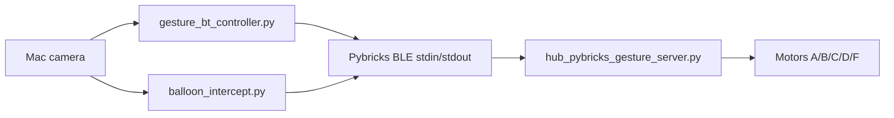

# Architecture

## Current Direction

The project uses **Mac/Python -> Pybricks BLE -> SPIKE Hub** as the primary
architecture.

## Canonical Code

`gesture_bt/` holds the primary tracked implementation for the final project.
The repository does not keep older transport experiments, copied packages, or
local harness configuration.

| Component | File |
|-----------|------|
| Hand gesture control (macOS) | `gesture_bt/gesture_bt_controller.py` |
| Hand gesture control (Windows, threaded) | `gesture_bt/gesture_bt_controller_win.py` |
| Balloon/target interception (macOS) | `gesture_bt/balloon_intercept.py` |
| Balloon/target interception (Windows, threaded) | `gesture_bt/balloon_intercept_win.py` |
| Hub firmware | `gesture_bt/hub_pybricks_gesture_server.py` |
| BLE/motor smoke test | `gesture_bt/bt_manual_motor_test.py` |
| Camera→angle calibration | `gesture_bt/calibrate_angle_regression.py` |
| Shared BLE client | `gesture_bt/pybricks_ble.py` |
| No-robot offline tools | `balloon_tracker_offline.py`, `hand_tracker_offline.py` |
| Design notes | `balloon_aimbot_design.md` |

The Windows variants run the Bleak BLE loop on a background thread while OpenCV
stays on the main thread, avoiding COM threading conflicts. The offline tools run
camera-only with no BLE for vision/prediction development without a robot.

## Shared Repository Boundary

The GitHub repository is intended for teammates, instructors, and TAs. Keep it
limited to the Pybricks BLE runtime code (incl. Windows/offline variants),
technical docs, design notes, and README status. The MediaPipe model is bundled
once at the repo root (`models/hand_landmarker.task`) for offline/Windows runs;
the first-run `gesture_bt/models/` download, local agent/harness files, virtual
environments, zip exports, and unrelated course projects should stay ignored.
