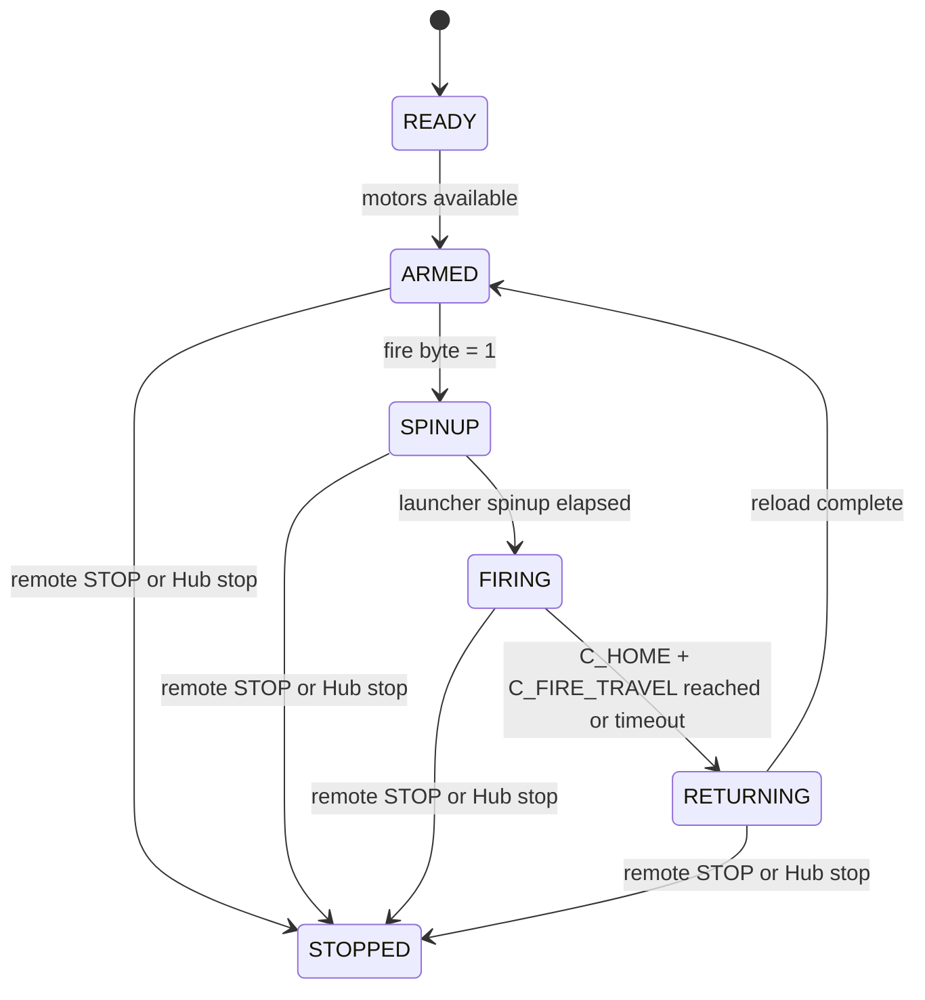

# State Machines

## Hub Firing Flow

The Hub keeps pan/tilt tracking independent from the firing state so the turret
can continue aiming while the launcher is armed.

The Hub consumes `fire=1` only while armed. It spins the launcher wheels first,
then logs the real F/D angles at the shot moment:

| Log | Timing |
|-----|--------|
| `FIRE_REQ` | `fire=1` accepted while armed |
| `SPINUP` | launcher wheels start |
| `SHOT f=... d=...` | C motor starts firing; F/D angles are captured |
| `RETURNING` | C motor starts returning |
| `ARMED` / `FIRED` | C motor returns to `C_HOME` and one shot is complete |

`balloon_intercept.py` joins the `SHOT f=... d=...` line with the pending
Mac-side aim context and appends one generated CSV row to `aim_dataset.csv`.

## Mac Target Interception Flow

```mermaid
stateDiagram-v2
  [*] --> Detecting
  Detecting --> TRACKING: HSV target found
  TRACKING --> LOCKED: predicted point inside fire window
  LOCKED --> TRACKING: predicted point leaves fire window
  LOCKED --> FIRED_FOR_TARGET: confirm frames satisfied; send M,pan,tilt,1 once
  FIRED_FOR_TARGET --> REARM_WAIT: target lost
  REARM_WAIT --> TRACKING: target absent for target-lost-rearm seconds
```

`balloon_intercept.py` sends `fire=1` at most once for one continuous target.
After BLE/Hub recovery it may replay the last aim command, but replay commands
are always `fire=0`.

## Hand Gesture Flow

Palm-visible frames drive pan/tilt error. A fist transition latches `fire=1`
once, then clears the fire byte on the next send interval.
