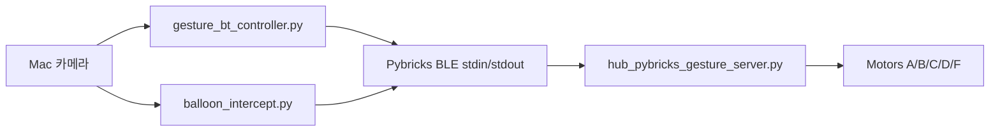

# 아키텍처

## 현재 방향

프로젝트 주력 구조는 **Mac/Python -> Pybricks BLE -> SPIKE Hub** 직결이다.

## 정본 코드

`gesture_bt/`가 기말 프로젝트의 주력 추적 구현이다. 과거 전송 방식 실험, 복사
패키지, 로컬 하네스 설정은 저장소에 포함하지 않는다.

| 구성 요소 | 파일 |
|-----------|------|
| 손 제스처 제어 (macOS) | `gesture_bt/gesture_bt_controller.py` |
| 손 제스처 제어 (Windows, 스레드) | `gesture_bt/gesture_bt_controller_win.py` |
| 풍선/표적 요격 (macOS) | `gesture_bt/balloon_intercept.py` |
| 풍선/표적 요격 (Windows, 스레드) | `gesture_bt/balloon_intercept_win.py` |
| Hub 펌웨어 | `gesture_bt/hub_pybricks_gesture_server.py` |
| BLE/모터 스모크 테스트 | `gesture_bt/bt_manual_motor_test.py` |
| 카메라→각도 캘리브레이션 | `gesture_bt/calibrate_angle_regression.py` |
| 공유 BLE 클라이언트 | `gesture_bt/pybricks_ble.py` |
| 로봇 없는 오프라인 도구 | `balloon_tracker_offline.py`, `hand_tracker_offline.py` |
| 설계 노트 | `balloon_aimbot_design.md` |

Windows 변형은 Bleak BLE 루프를 백그라운드 스레드에서 돌리고 OpenCV를 메인
스레드에 두어 COM 스레딩 충돌을 피한다. 오프라인 도구는 로봇 없이 비전/예측을
개발하도록 BLE 없이 카메라만으로 동작한다.

## 공유 저장소 경계

GitHub 저장소는 팀원, 교수, TA가 보는 공유 공간이다. Pybricks BLE 실행 코드
(Windows/오프라인 변형 포함), 기술 문서, 설계 노트, README 상태판을 추적한다.
MediaPipe 모델은 오프라인/Windows 실행용으로 저장소 루트
(`models/hand_landmarker.task`)에 한 번 동봉한다. 최초 실행 시 받는
`gesture_bt/models/` 다운로드, 로컬 agent/harness 파일, 가상환경, zip 내보내기,
다른 과목 프로젝트는 Git에서 무시한다.
