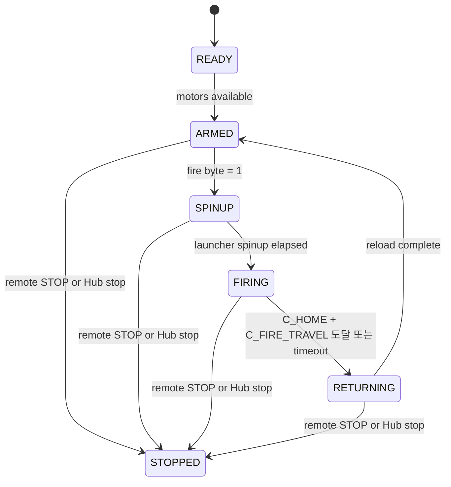

# 상태 머신

## Hub 발사 흐름

Hub는 발사 상태와 팬/틸트 추적을 분리한다. 따라서 armed 상태에서 조준을 계속
갱신하다가 `fire=1`이 들어오면 발사 상태로 진입한다.

Hub는 armed 상태에서만 `fire=1`을 소비한다. 먼저 발사 휠을 spinup하고, 실제
발사 순간 F/D 각도를 로그로 남긴다.

| 로그 | 시점 |
|------|------|
| `FIRE_REQ` | armed 상태에서 `fire=1` 수락 |
| `SPINUP` | 발사 휠 구동 시작 |
| `SHOT f=... d=...` | C 모터 발사 시작; F/D 각도 기록 |
| `RETURNING` | C 모터 복귀 시작 |
| `ARMED` / `FIRED` | C 모터가 `C_HOME`으로 복귀하고 1발 완료 |

`balloon_intercept.py`는 `SHOT f=... d=...` 라인을 Mac 측 pending aim context와
결합해 generated CSV row를 `aim_dataset.csv`에 추가한다.

## Mac 표적 요격 흐름

```mermaid
stateDiagram-v2
  [*] --> Detecting
  Detecting --> TRACKING: HSV target found
  TRACKING --> LOCKED: predicted point inside fire window
  LOCKED --> TRACKING: predicted point leaves fire window
  LOCKED --> FIRED_FOR_TARGET: confirm frames satisfied; send M,pan,tilt,1 once
  FIRED_FOR_TARGET --> REARM_WAIT: target lost
  REARM_WAIT --> TRACKING: target absent for target-lost-rearm seconds
```

`balloon_intercept.py`는 연속으로 보이는 같은 표적에는 최대 한 번만 `fire=1`을
보낸다. BLE/Hub 복구 후 마지막 조준 명령을 replay할 수 있지만, replay 명령은 항상
`fire=0`이다.

## 손 제스처 흐름

손바닥이 보이면 화면 중심 대비 오차로 팬/틸트를 제어한다. 주먹 전환은
`fire=1`을 한 번 래치한 뒤 다음 전송에서 해제한다.
