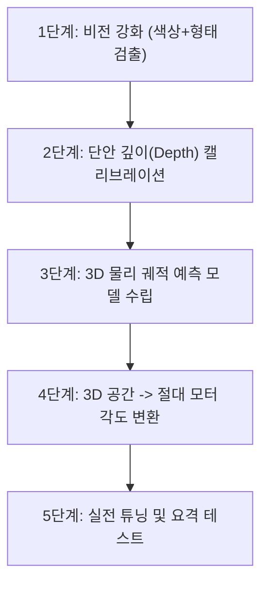

# 풍선 추적 및 자동 조준 발사기 디자인 계획서
*(Balloon Tracking & Aimbot System Design Plan)*

이 문서는 고정 웹캠과 LEGO SPIKE 발사기를 이용하여 **던져진 풍선**을 인식하고, 조준하여 발사하는 시스템의 상세 구현 단계와 핵심 물리/기하학적 고려 사항을 다룹니다.

---

## 1. 핵심 고려 사항 분석 (Constraints Analysis)

### 🎈 고려 사항 1: 풍선은 온전한 포물선 운동을 하는가?
> **결론: 아니오. 풍선은 심한 공기 저항(Drag)과 부력(Buoyancy)의 영향을 받아 비대칭 궤적을 그립니다.**

1. **공기 저항 (Air Resistance)**
   - 일반 고무공이나 금속구체와 달리, 풍선은 **질량 대비 표면적이 매우 큽니다 (Low Terminal Velocity)**.
   - 공기 저항력 $F_d = \frac{1}{2} \rho v^2 C_d A$ 은 속도의 제곱에 비례하여 작용하므로, 던진 직후 빠르게 감속합니다.
   - 이로 인해 상승할 때는 완만하게 가다가 정점을 찍은 후 **급격하게 수직으로 떨어지는 비대칭형 탄도 궤적**을 그립니다.
2. **부력 및 주변 기류 (Buoyancy & Wind)**
   - 헬륨을 넣지 않은 일반 풍선이라도 내부 공기 밀도와 외부 공기 밀도가 비슷하여 부력의 영향을 크게 받으며, 에어컨 바람이나 미세한 기류에도 쉽게 궤적이 흔들립니다.

> [!TIP]
> **대응 방안:**
> - **감속도 모델 반영:** $x$축 등속 운동이 아닌, 속도에 비례하는 감속 항($a_x = -k \cdot v_x$)을 물리 모델에 추가해야 합니다.
> - **빠른 요격 (Short Lead-Time):** 풍선이 날아가는 먼 미래를 예측하기보다, 발사 직후 아주 짧은 시간(예: 0.2~0.3초) 내에 요격할 수 있도록 발사 속도를 높이고 조준 루프를 빠르게 회전시킵니다.

---

### 📷 고려 사항 2: 카메라 평면과 비평행한 3D 운동 (깊이 정보의 부재)
> **결론: 풍선이 카메라에 가까워지거나 멀어지면 2D 화면에서의 속도 및 위치가 왜곡됩니다.**

1. **원근 효과 (Perspective Projection)**
   - 풍선이 카메라와 평행하게 움직이지 않고 비스듬히 날아가면, 카메라에 가까워질 때는 화면상에서 빠르게 움직이는 것처럼 보이고, 멀어질 때는 느리게 움직이는 것처럼 보입니다.
   - 또한, 픽셀 좌표 $(x, y)$가 같더라도 실제 풍선과의 거리(깊이, $Z$)에 따라 포탑이 조준해야 할 **물리적 틸트(우각) 및 팬 각도가 완전히 달라집니다.**

> [!IMPORTANT]
> **대응 방안: 단안 카메라 깊이 추정 (Monocular Depth Estimation)**
> - 풍선은 팽창된 크기(지름 약 20~25cm)가 일정하게 유지되는 구체입니다.
> - OpenCV 컨투어 분석을 통해 풍선의 **픽셀 지름(Width/Height) 또는 면적(Area)**을 구하고, 카메라 초점 거리($f$)를 이용해 실시간 물리적 거리 $Z$(깊이)를 추정할 수 있습니다.
>   $$Z_{real} = \frac{W_{physical} \cdot f}{W_{pixel}}$$
> - 이 $Z$값을 이용해 2D 화면 좌표 $(x, y)$를 3D 공간 좌표 $(X, Y, Z)$로 변환한 후 3D 물리 조준을 수행합니다.

---

## 2. 기능 구현을 위한 5단계 로드맵

풍선 자동 조준 시스템을 완성하기 위해 필요한 개발 단계를 정의합니다.

### 1단계: 비전 필터링 강화 (풍선 특화 검출)
*풍선은 흔들림이 많고 크기가 크므로 기존의 단순 점 추적에서 영역 추적 방식으로 개선합니다.*
- **HSV 색상 영역 최적화:** 풍선 고유의 색상(예: 노란색, 파란색 등 단색 풍선 권장)을 명확하게 필터링할 수 있도록 HSV 임계값 튜닝.
- **원형도(Circularity) 필터 적용:** 풍선이 둥근 모양을 유지하므로, 외곽선(Contour)의 면적 대비 둘레 비율을 계산하여 배경 잡음(빨간 옷, 가구 등)을 배제하고 풍선만 정확히 타겟팅합니다.

### 2단계: 3D 깊이(Depth) 카메라 캘리브레이션
*카메라와 물리 세계의 스케일을 일치시키는 작업입니다.*
- **지름-거리 맵 구축:** 풍선을 카메라 앞 1m, 1.5m, 2m, 2.5m 등 알려진 거리에 두고 픽셀 지름(반지름)을 측정하여 거리 대 픽셀 비례 상수(Scale Factor)를 얻습니다.
- **3D 좌표계 매핑:** 웹캠 렌즈의 초점 거리(Focal Length)와 화각(FOV)을 바탕으로, 화면 중심으로부터의 픽셀 편차 $(dx, dy)$와 추정 거리 $Z$를 조합하여 로봇을 원점으로 하는 실제 3D 좌표 $(X, Y, Z)$ (단위: 미터)를 실시간 계산합니다.

### 3단계: 3D 공기 저항 물리 예측 모델 수립
*단순 포물선이 아닌 공기 저항이 들어간 3D 물리 엔진을 가볍게 구현합니다.*
- **상태 추정 (State Estimation):** 이전 프레임들의 3D 위치 $(X, Y, Z)$ 차이를 통해 3D 속도 벡터 $(v_x, v_y, v_z)$를 구합니다.
- **공기저항 모델 시뮬레이션:**
  - $a_x = -k \cdot v_x$
  - $a_y = -k \cdot v_y$ (수평면)
  - $a_z = -g - k \cdot v_z$ (수직면 - 중력 + 공기저항)
  - 위 미분방정식을 오일러 적분(Euler Integration)으로 수십 ms 단위로 전진 시뮬레이션하여 발사체와 풍선이 만나는 **요격 3D 좌표 $(X_{aim}, Y_{aim}, Z_{aim})$**를 예측합니다.

### 4단계: 3D 조준 좌표 $\rightarrow$ 절대 모터 각도 매핑
*웹캠이 포탑 바로 아래에 완벽히 정렬되어 고정되어 있는 기하학적 이점을 활용합니다.*
- **기하학적 역기하학 (Inverse Kinematics):**
  - **팬 각도 (Yaw, $\theta_{pan}$):** 수평 3D 평면에서의 삼각함수 아크탄젠트로 직접 구합니다.
    $$\theta_{pan} = \arctan2(X_{aim}, Z_{aim})$$
  - **틸트 각도 (Pitch, $\theta_{tilt}$):** 포탄의 초속($v_0$)과 중력을 고려하여 물리적인 틸트 각도를 계산합니다. 풍선이 가볍기 때문에 발사체의 비행 속도를 매우 빠르게 설정하면 직선에 가까운 탄도를 가지므로 기하학적 각도로 근사할 수 있습니다.
    $$\theta_{tilt} = \arctan2(Y_{aim}, Z_{aim})$$
- 이 물리 각도들을 LEGO SPIKE 허브의 제어 범위(`PAN_MAX_DEG`, `TILT_MAX_DEG`)에 맞춰 `[-100, +100]` 값으로 매핑하여 송신합니다.

### 5단계: 통합 테스트 및 하드웨어 튜닝
- **`--no-ble` 모드 기반 3D 예측 디버깅:** 
  실제 로봇을 연결하지 않은 상태에서 카메라만 켜고 풍선을 던져, 화면상에 **풍선의 실시간 3D 위치 및 깊이 정보가 안정적으로 표시되는지**, 그리고 **예측된 3D 요격점**이 풍선 진행 방향 앞쪽에 부드럽게 위치하는지 프리뷰 화면으로 먼저 검증합니다.
- **발사 딜레이(Latency) 보상:** 
  블루투스 전송 지연 시간(약 50~100ms)과 모터가 해당 각도까지 회전하는 시간, 그리고 물리 발사기가 격발하는 데 걸리는 기계적 딜레이를 합산하여 요격 예측 시간(`FLIGHT_TIME`)에 가산해 줍니다.
- **실사격 튜닝:** 풍선의 낙하 속도가 느리므로 발사 휠 모터 파워를 조절하여 조준 정확도를 매칭시킵니다.
