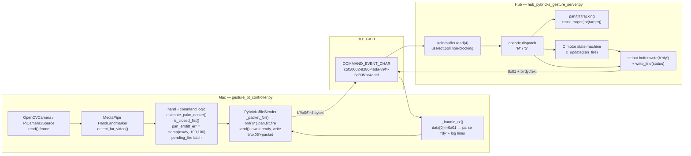

# ARCHITECTURE

System architecture for the gesture-controlled LEGO SPIKE Prime turret. A Mac
runs computer-vision hand tracking and streams motor commands over Bluetooth Low
Energy (BLE) to a Pybricks-flashed SPIKE Prime Hub, which runs a position-tracking
and fire state machine.

## 1. System Overview (Mac ↔ BLE ↔ Hub)

```
┌────────────────────────── Mac (laptop / Raspberry Pi) ──────────────────────────┐
│                                                                                  │
│  Webcam ──► OpenCV frame ──► MediaPipe Hand Landmarker ──► hand→command logic    │
│                                                              │                   │
│                                                  "M,pan_err,tilt_err,fire"       │
│                                                              │                   │
│                                                   PybricksBleSender.send()       │
│                                                              │                   │
│                                          waits for rdy, then writes              │
│                                          b"\x06" + 4-byte packet                 │
└──────────────────────────────────────────────────────────────┼─────────────────┘
                                                                 │  BLE GATT write
                          PYBRICKS_COMMAND_EVENT_CHAR_UUID =      │  (response=True)
                          c5f50002-8280-46da-89f4-6d8051e4aeef    │
                                                                 ▼
┌────────────────────────── SPIKE Prime Hub (Pybricks) ───────────────────────────┐
│                                                                                  │
│  stdin.buffer.read(4) ◄── 0x06 framing stripped by Pybricks ◄── BLE             │
│         │                                                                        │
│         ▼                                                                        │
│  opcode dispatch:  'M' → accumulate pan/tilt target + latch fire                 │
│                    'S' → stop all and exit                                       │
│         │                                                                        │
│         ├─► pan_motor.track_target / tilt_motor.track_target                     │
│         ├─► c_update() fire state machine (armed→firing→returning→armed)         │
│         └─► stdout.buffer.write(b"rdy")  ──► BLE notify (0x01 prefix) ──► Mac     │
└──────────────────────────────────────────────────────────────────────────────-─┘
```

The Mac side never blocks on a hardware-level ACK. Instead it gates each send on
the application-level `rdy` token emitted by the Hub. This couples the two loops
without a fixed clock: the Hub paces the Mac.

### Physical ports (Hub)

| Port | Motor | Role |
|------|-------|------|
| A | `launch_l` | Launcher flywheel (PWM `LAUNCH_PWM_A = 100`) |
| B | `launch_r` | Launcher flywheel, opposite spin (PWM `LAUNCH_PWM_B = -100`) |
| C | `c_motor` | Trigger / reload reciprocating motor (fire state machine) |
| D | `tilt_motor` | Tilt axis (`track_target`) |
| F | `pan_motor` | Pan axis (`track_target`) |

Each port is acquired via `safe_motor()`, which reports `PORT_<label>_OK` or
`PORT_<label>_MISSING` over stdout and tolerates a missing motor (returns `None`).

## 2. BLE Connect → rdy Handshake → Packet Loop (Sequence)

```mermaid
sequenceDiagram
    participant Mac as Mac (PybricksBleSender)
    participant BLE as BLE GATT
    participant Hub as Hub (hub_pybricks_gesture_server)

    Mac->>BLE: BleakScanner.find_device_by_name(hub_name)
    BLE-->>Mac: device handle
    Mac->>BLE: client.connect()
    Mac->>BLE: start_notify(COMMAND_EVENT_CHAR, _handle_rx)
    Note over Mac: connected = True

    Note over Hub: User presses Hub center button → main() runs
    Hub->>Hub: stop_all(); reset_angle(0) on pan/tilt/C
    Hub->>Hub: start_launcher_wheels(); display "BT"
    Hub-->>Mac: stdout b"READY" / b"ARMED" (lines, 0x01 prefixed)
    Hub-->>Mac: stdout b"rdy"  (initial handshake)
    Note over Mac: _handle_rx sees "rdy" → self.ready.set()

    loop per send_interval (0.10 s)
        Mac->>Mac: await ready.wait() (timeout=1.0 s)
        Mac->>Mac: ready.clear()
        Mac->>BLE: write_gatt_char(b"\x06" + 4-byte packet, response=True)
        BLE->>Hub: stdin delivers 4 bytes
        Hub->>Hub: read(4); dispatch opcode 'M'/'S'
        Hub->>Hub: track_target(pan/tilt); c_update(can_fire)
        Hub-->>Mac: stdout b"rdy"  (ack: ready for next packet)
        Note over Mac: ready.set() again → next send unblocks
    end

    Mac->>BLE: write_gatt_char(b"\x06" + b"S\x00\x00\x00")
    Hub->>Hub: running = False → stop_all(); display "X"
```

Key detail: the Hub sends **one initial `rdy`** at startup (line 162) and then
**one `rdy` after every received packet** (lines 190–193, inside the
`if keyboard.poll(0):` block). The Mac strictly alternates `ready.wait()` /
`ready.clear()` so exactly one packet is in flight at a time.

## 3. Component Diagram (MediaPipe → Sender → BLE → Hub → State Machine)



## 4. Deadlock Recovery Mechanism (heartbeat)

The flow-control design — Mac waits for `rdy`, Hub waits for a packet — is a
classic mutual-wait that can deadlock if a single token is lost on the BLE link.

### The deadlock condition

`bt_manual_motor_test.py` documents the failure mode explicitly (lines 102–104):

> Do NOT clear ready here — hub.send() consumes it for the first command.
> Clearing here causes a deadlock: send() waits for rdy, but Hub waits for a packet.

If a `rdy` notification is dropped, the Mac's `await asyncio.wait_for(self.ready.wait(), ...)`
never resolves and the Hub sits idle in its `keyboard.poll(0)` branch waiting for
the next 4 bytes that never come.

### Recovery on the Mac side (`send()`, lines 162–173)

The `await ready.wait()` is bounded by `timeout=timeout` (default `1.0` s). On
`asyncio.TimeoutError` the send is **abandoned, not retried-blocking**: `send()`
simply returns. Because the camera loop calls `send()` again every
`send_interval` (0.10 s), the next packet attempt re-waits for `rdy`. As soon as
any later `rdy` arrives (the Hub keeps emitting one per processed packet), the
loop re-synchronizes. A throttled diagnostic is printed at most every 2.0 s
(`now - self.last_wait_log > 2.0`) prompting the user to check the Hub.

### Recovery on the Hub side (safety timeout, lines 213–216)

The Hub does not depend on continuous traffic to stay safe. Every loop iteration
it checks:

```python
if watch.time() - last_cmd_ms > COMMAND_TIMEOUT_MS:   # 1000 ms
    pan_target  = 0.0
    tilt_target = 0.0
```

If no `'M'` packet arrives for `COMMAND_TIMEOUT_MS = 1000` ms, the pan/tilt
targets collapse to center (0.0), so a stalled or lost link parks the turret
rather than freezing it at the last commanded angle. The C-motor state machine
still advances independently each iteration, so an in-progress fire/reload
completes regardless of link state.

### Net effect

The `rdy` token acts as a per-packet heartbeat. A lost beat costs at most one
`COMMAND_TIMEOUT_MS` window on the Hub (turret recenters) and one `timeout`
window on the Mac (one dropped send), after which the next `rdy`/packet pair
re-establishes lockstep. There is no persistent deadlock state because both
sides have independent timeouts rather than an unbounded mutual wait.
