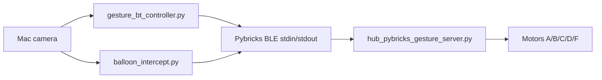

# Architecture

## Current Direction

The project uses **Mac/Python -> Pybricks BLE -> SPIKE Hub** as the primary
architecture.

## Canonical Code

`gesture_bt/` is the only tracked implementation for the final project. The
repository does not keep older transport experiments, copied packages, generated
model files, or local harness configuration.

| Component | File |
|-----------|------|
| Hand gesture control | `gesture_bt/gesture_bt_controller.py` |
| Balloon/target interception | `gesture_bt/balloon_intercept.py` |
| Hub firmware | `gesture_bt/hub_pybricks_gesture_server.py` |
| BLE/motor smoke test | `gesture_bt/bt_manual_motor_test.py` |
| Shared BLE client | `gesture_bt/pybricks_ble.py` |

## Shared Repository Boundary

The GitHub repository is intended for teammates, instructors, and TAs. Keep it
limited to the current Pybricks BLE runtime code, technical docs, and README
status. Local agent/harness files, virtual environments, zip exports, model
downloads, and unrelated course projects should stay ignored.
