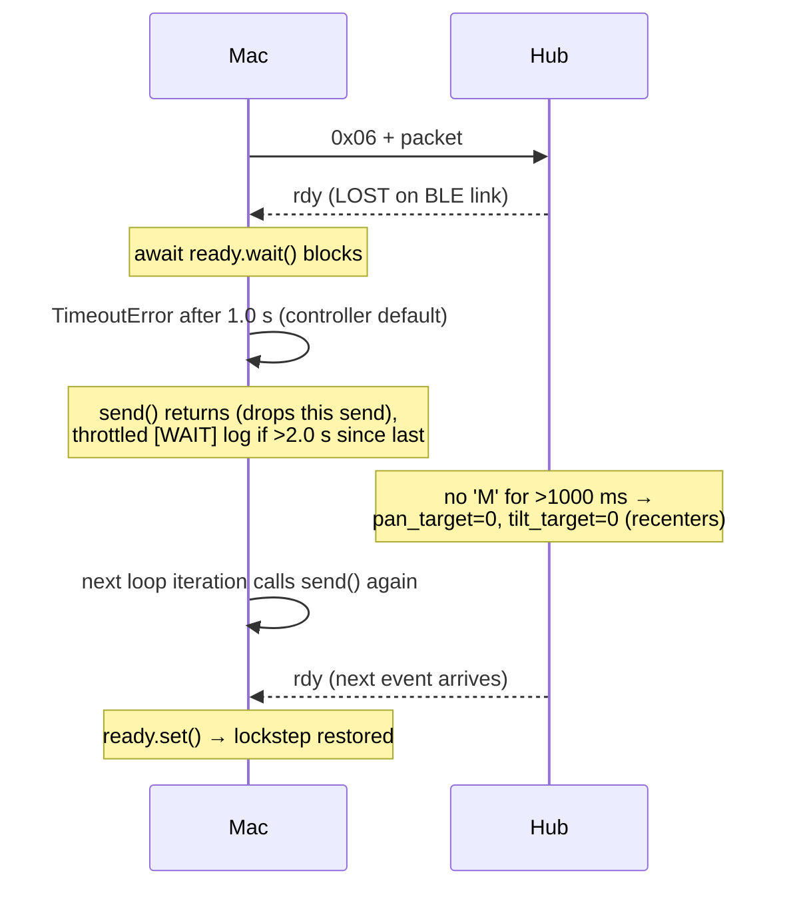

# PROTOCOL

Wire protocol between the Mac controller (`gesture_bt_controller.py`,
`bt_manual_motor_test.py`) and the Pybricks Hub program
(`hub_pybricks_gesture_server.py`). Transport is BLE GATT on the Pybricks
command/event characteristic:

```
PYBRICKS_COMMAND_EVENT_CHAR_UUID = "c5f50002-8280-46da-89f4-6d8051e4aeef"
```

## 1. Framing

| Direction | Framing | Notes |
|-----------|---------|-------|
| Mac → Hub | `b"\x06"` prefix + 4 payload bytes | `0x06` is the Pybricks "write to stdin" command. Pybricks strips it and delivers the 4 payload bytes to the program's `stdin`. |
| Hub → Mac | `0x01` prefix + payload | `0x01` is the Pybricks "stdout event". The Mac checks `data[0] == 0x01` before parsing. |

The Mac always writes with `response=True`:

```python
await self.client.write_gatt_char(
    PYBRICKS_COMMAND_EVENT_CHAR_UUID,
    b"\x06" + packet,
    response=True,
)
```

## 2. Mac → Hub Packet Format (4 bytes after 0x06)

Built by `PybricksBleSender._packet_for()` / `bt_manual_motor_test.packet_for()`
and consumed by the Hub via `stdin.buffer.read(4)`.

| Byte | Field | Type | Encoding | Hub-side decode |
|------|-------|------|----------|-----------------|
| 0 | `opcode` | `uint8` | `ord("M")` = 0x4D (move) or `ord("S")` = 0x53 (stop) | `opcode = data[0]` |
| 1 | `pan_err` | `int8` | clamped to `[-100, 100]`, then `value & 0xFF` (two's complement) | `pan_err = i8(data[1])` |
| 2 | `tilt_err` | `int8` | clamped to `[-100, 100]`, then `value & 0xFF` | `tilt_err = i8(data[2])` |
| 3 | `fire` | `uint8` | `0` or `1` (`int(parts[3]) & 0xFF`) | `fire = data[3]` |

### int8 round-trip

Mac encode (`_i8`, controller lines 143–146):

```python
value = max(-100, min(100, int(value)))
return value & 0xFF        # negative → 256+value, e.g. -100 → 156 (0x9C)
```

Hub decode (`i8`, server lines 82–83):

```python
return byte_value - 256 if byte_value > 127 else byte_value
```

So `pan_err`/`tilt_err` are recovered exactly on the Hub, range `[-100, 100]`.

### Stop packet

`STOP` maps to the literal `b"S\x00\x00\x00"` (opcode `'S'`, three zero bytes).
The Hub sets `running = False` and exits its loop, then `stop_all()` and shows
`"X"`. Note: `bt_manual_motor_test.HubClient.close()` sends the string
`"CENTER"`, which is unknown to `packet_for()` and raises `ValueError`; the call
is wrapped in `try/except`, so close still proceeds to `client.disconnect()`.

### Semantics on the Hub (opcode 'M')

`pan_err`/`tilt_err` are **incremental error inputs**, not absolute angles. They
accumulate into target angles (see `STATE_MACHINES.md`):

```python
pan_target  = clamp(pan_target  - PAN_SIGN  * pan_err  * GAIN, PAN_MIN,  PAN_MAX)
tilt_target = clamp(tilt_target - TILT_SIGN * tilt_err * GAIN, TILT_MIN, TILT_MAX)
if fire == 1:
    can_fire = True   # latch until shot fires
last_cmd_ms = watch.time()
```

## 3. Hub → Mac Messages

Hub output is line-oriented text plus the bare `rdy` token, all emitted on
`stdout.buffer` and delivered to the Mac inside `0x01`-prefixed notifications.

| Message | Meaning |
|---------|---------|
| `b"rdy"` | Flow-control token: Hub is ready for the next packet. NOT newline-terminated. |
| `PORT_<label>_OK` / `PORT_<label>_MISSING` | Per-port motor init result. |
| `READY`, `ARMED`, `FIRING`, `RETURNING`, `FIRED` | Status lines (newline-terminated via `write_line`). |

Mac-side handling (`_handle_rx`, controller lines 124–141): if `b"rdy" in payload`,
call `self.ready.set()` and strip `rdy` from the payload; remaining text is
buffered and split on `\n` into `[Hub] <line>` log prints.

### Heartbeat policy

`rdy` is the heartbeat. There is **no fixed timer** emitting it; it is event-driven:

1. **Startup**: exactly one `rdy` after `READY`/`ARMED` (server line 162), so the
   Mac can begin sending.
2. **Per packet**: exactly one `rdy` after every received 4-byte packet (server
   lines 190–193), inside the same `if keyboard.poll(0):` block that read the
   packet.

The Mac enforces one-packet-in-flight by clearing `ready` immediately after each
wait succeeds (`self.ready.clear()`), so the cadence is effectively one `rdy` per
`send_interval` (0.10 s) — i.e. a ~10 Hz application heartbeat, paced by the Hub.

## 4. rdy Handshake Flow

### Normal flow

```mermaid
sequenceDiagram
    participant Mac
    participant Hub
    Hub-->>Mac: rdy (initial, after READY/ARMED)
    Note over Mac: ready.set()
    Mac->>Mac: await ready.wait() → ok; ready.clear()
    Mac->>Hub: 0x06 + [M,pan,tilt,fire]
    Hub->>Hub: read(4), apply command
    Hub-->>Mac: rdy
    Note over Mac: ready.set()
    Mac->>Mac: next send: await ready.wait() → ok; ready.clear()
    Mac->>Hub: 0x06 + next packet
```

### Loss / recovery flow



## 5. Timeout Policy

| Timeout | Value | Location | Effect |
|---------|-------|----------|--------|
| Command timeout (Hub) | `COMMAND_TIMEOUT_MS = 1000` ms | server lines 54, 213–216 | No `'M'` packet for 1000 ms → pan/tilt targets reset to 0.0 (recenter). |
| `send()` rdy wait (controller) | `timeout = 1.0` s default | controller line 162, 166 | `ready.wait()` bounded; on timeout the send is skipped (not blocking-retried). |
| Close-time STOP (controller) | `timeout = 0.2` s | controller lines 187, 468 | Best-effort STOP on shutdown. |
| `send()` rdy wait (manual test) | `timeout = 5.0` s default, `10.0` s per command | test lines 70, 129 | Longer waits for the slower manual test sequence. |
| Scan timeout | `15.0` s | both `connect()` | BLE device discovery window. |
| BLE write ACK | `response=True` | all writes | GATT-level write-with-response; orthogonal to the `rdy` application ACK. |

The two layers are independent: GATT `response=True` confirms the bytes reached
the characteristic; `rdy` confirms the Hub program processed the packet and is
ready for the next one. Deadlock recovery relies on the application-layer
timeouts (1000 ms Hub, 1.0 s Mac), not on the GATT layer.
