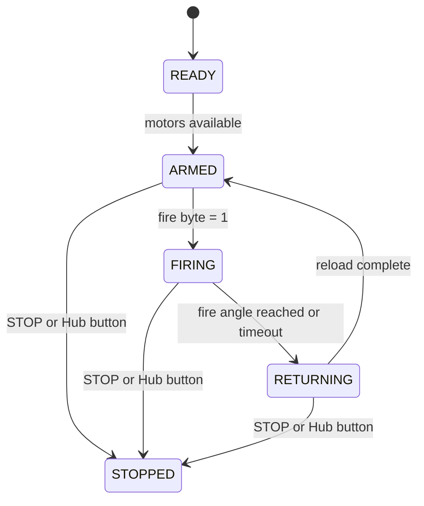
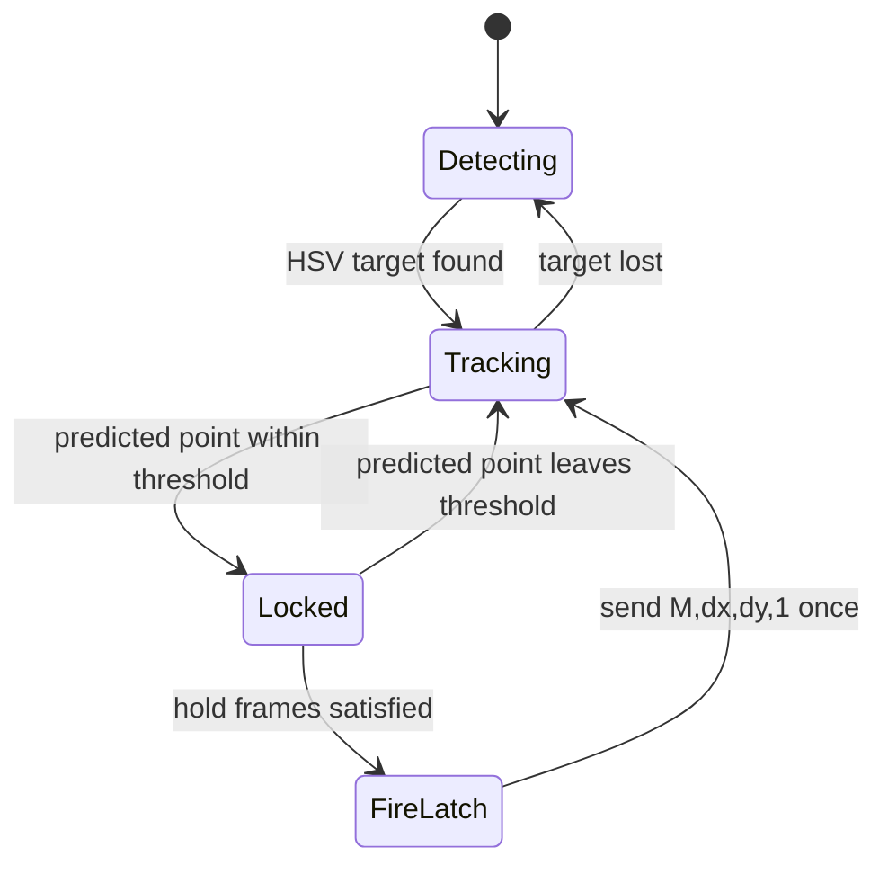

# State Machines

## Hub Firing Flow

The Hub keeps pan/tilt tracking independent from the firing state so the turret
can continue aiming while the launcher is armed.

The Hub prints angle snapshots during the shot:

| Log | Timing |
|-----|--------|
| `SHOT_START` | `fire=1` is accepted and the C motor starts moving |
| `SHOT_RELEASE` | The C motor reaches `C_FIRE_ANGLE - C_TOLERANCE` |
| `SHOT_DONE` | The C motor returns to the armed position |

Each snapshot includes actual `pan_F`, `tilt_D`, `c_C` motor angles plus
`target_pan` and `target_tilt`.

## Mac Target Interception Flow

`balloon_intercept.py` sends `fire=1` only for one packet. Subsequent packets
return to `fire=0` while pan/tilt error continues to update.

## Hand Gesture Flow

Palm-visible frames drive pan/tilt error. A fist transition latches `fire=1`
once, then clears the fire byte on the next send interval.
