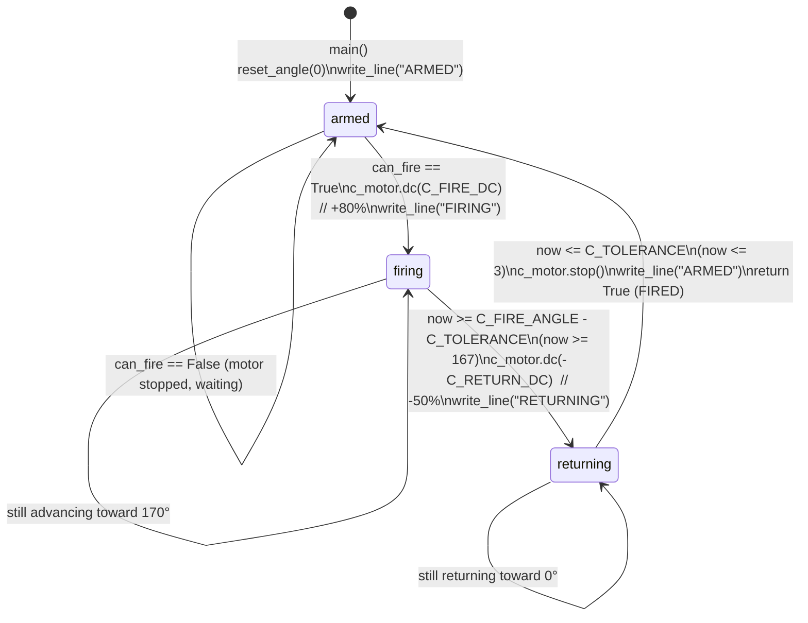

# STATE MACHINES

Control logic that runs on the Hub (`hub_pybricks_gesture_server.py`) plus the
fire-latching logic split across the Hub and the Mac
(`gesture_bt_controller.py`).

## 1. C Motor Fire State Machine (왕복 / reciprocating)

Port C drives the trigger/reload mechanism. Start position `0°` = fully armed
(rubber band loaded). The state is held in the module-level `c_state` and
advanced once per main-loop iteration by `c_update(can_fire)`.

### Constants (server lines 60–63)

| Constant | Value | Meaning |
|----------|-------|---------|
| `C_FIRE_ANGLE` | `170` deg | Forward fire position (rubber band release). |
| `C_FIRE_DC` | `80` % | Forward (fire) duty cycle. |
| `C_RETURN_DC` | `50` % | Reverse (reload) duty cycle, applied as `-C_RETURN_DC`. |
| `C_TOLERANCE` | `3` deg | Angle slack for reaching fire/home positions. |

### State diagram



### Transition logic (server `c_update`, lines 110–136)

```python
now = c_motor.angle()
if c_state == "armed":
    if can_fire:
        c_motor.dc(C_FIRE_DC); c_state = "firing"; write_line("FIRING")
elif c_state == "firing":
    if now >= C_FIRE_ANGLE - C_TOLERANCE:          # now >= 167
        c_motor.dc(-C_RETURN_DC); c_state = "returning"; write_line("RETURNING")
elif c_state == "returning":
    if now <= C_TOLERANCE:                          # now <= 3
        c_motor.stop(); c_state = "armed"; write_line("ARMED")
        return True                                 # fire + reload complete
return False
```

When `c_update` returns `True`, the main loop emits `FIRED` and clears the latch
(`can_fire = False`, server lines 207–209), so the next fire requires a fresh
`fire=1` from the Mac.

The state machine is **non-blocking**: each call reads the angle once and makes at
most one transition. The forward (`dc`) and reverse motions run open-loop between
iterations, advancing while the main loop continues to service pan/tilt tracking
and BLE I/O.

## 2. Fire Latch Mechanism — why `pending_fire` exists

A fire request crosses two independent loops running at different rates, and a
fist is an instantaneous edge event while sends are periodic samples. Two latches
cooperate so a single fist produces exactly one shot.

### Latch A — Mac edge-to-interval latch (`pending_fire`)

Detection runs every camera frame, but commands are sent only every
`send_interval` (0.10 s). A fist transition can occur between sends, so the edge
must be held until the next send window.

Edge detection (controller lines 433–436):

```python
# latch fire on open→fist transition; consumed at send time
if fist and not prev_fist:
    pending_fire = True
prev_fist = fist
```

Consumption at send time (controller lines 444–448):

```python
if now - last_send_time >= args.send_interval:
    if result.hand_landmarks:
        fire_to_send = 1 if pending_fire else 0
        pending_fire = False
        command = f"M,{pan_err},{tilt_err},{fire_to_send}"
```

**Why it is needed (the Mac-side timing issue):** without `pending_fire`, the
code would have to read the live `fist` boolean at send time. If the fist
occurred and released between two send instants, the event would be lost; if the
fist were held across several sends, it would emit `fire=1` repeatedly and fire
multiple times. `pending_fire` decouples the asynchronous open→fist *edge* from
the periodic *send sample* — it captures the edge whenever it happens and
guarantees exactly one `fire=1` is delivered at the next send, then resets.
`prev_fist` ensures only the open→fist transition (not a held fist) sets it.

### Latch B — Hub shot latch (`can_fire`)

On the Hub, `fire == 1` sets `can_fire = True` and it stays set "until shot fires"
(server lines 184–185). The C state machine consumes it only in the `armed`
state, so a fire request that arrives mid-cycle is honored once the mechanism
returns to armed, and `can_fire` is cleared on completion (`can_fire = False`,
server line 209). This prevents a request from being dropped if it lands while
the motor is already firing or returning, and prevents auto-repeat afterward.

### Combined guarantee

```
open→fist edge (any frame)  →  pending_fire=True
   → next send (0.10 s grid) →  fire=1 sent once, pending_fire=False
      → Hub: can_fire=True (latched)
         → C machine reaches armed → fires once → FIRED → can_fire=False
```

One fist ⇒ one shot, robust to both inter-send timing on the Mac and
mid-cycle arrival on the Hub.

## 3. Pan / Tilt Tracking — GAIN accumulation

Pan and tilt are **integral (accumulating) controllers**. The Mac sends an error
signal each tick; the Hub integrates it into an absolute target angle and lets
Pybricks' `track_target` close the position loop.

### Constants (server lines 45–53)

| Constant | Value | Meaning |
|----------|-------|---------|
| `PAN_SIGN` / `TILT_SIGN` | `1` / `1` | Direction flip (set to `-1` if axis moves the wrong way). |
| `PAN_MIN` / `PAN_MAX` | `-35` / `35` deg | Pan target clamp range. |
| `TILT_MIN` / `TILT_MAX` | `0` / `80` deg | Tilt target clamp range. |
| `PAN_SPEED` / `TILT_SPEED` | `600` / `500` deg/s | Speed feedforward (constants for tuning). |
| `GAIN` | `0.05` | Degrees of target change per 1 unit of error. |

### Accumulation (server lines 182–183)

```python
pan_target  = clamp(pan_target  - PAN_SIGN  * pan_err  * GAIN, PAN_MIN,  PAN_MAX)
tilt_target = clamp(tilt_target - TILT_SIGN * tilt_err * GAIN, TILT_MIN, TILT_MAX)
```

Each received error nudges the running target by `error * GAIN` degrees and the
result is clamped to the axis limits. With `GAIN = 0.05`, a maximum error of
`100` shifts the target by `100 * 0.05 = 5` deg per packet. At the ~10 Hz send
rate this is ~50 deg/s of target slew, so the turret pans/tilts smoothly toward
where the hand is rather than snapping. The sign of `pan_err`/`tilt_err` (offset
of the palm from frame center, clamped to `[-100, 100]` on the Mac) determines
direction; the subtraction plus `PAN_SIGN`/`TILT_SIGN` sets the convention.

### Applying the target (server lines 195–200)

```python
if pan_motor:
    pan_motor.track_target(int(pan_target))
if tilt_motor:
    tilt_motor.track_target(int(tilt_target))
```

`track_target` runs continuously every loop iteration (5 ms `wait`), driving the
motors to the latest integrated target. Errors of 0 (no hand, or palm centered
within the Mac deadzone) leave the target unchanged, holding position.

## 4. Safety Timeout Behavior

A loss of command traffic must not leave the turret aimed and powered at the last
target. Every iteration the Hub checks the time since the last `'M'` packet
(server lines 213–216):

```python
if watch.time() - last_cmd_ms > COMMAND_TIMEOUT_MS:   # 1000 ms
    pan_target  = 0.0
    tilt_target = 0.0
```

`last_cmd_ms` is refreshed on every `'M'` packet (`last_cmd_ms = watch.time()`).
If 1000 ms pass with no command (link stall, lost `rdy`, Mac crash), pan and tilt
targets collapse to `0.0`, so `track_target` drives the turret back to center.
The C-motor state machine is intentionally **not** reset by this timeout: an
in-progress fire/reload completes safely rather than stopping mid-stroke.

Additional stop paths:

- **Emergency stop button**: `if hub.buttons.pressed(): running = False` (server
  lines 219–220) exits the loop → `stop_all()` + display `"X"`.
- **Stop opcode**: a `'S'` packet sets `running = False` (lines 187–188).
- **Exception guard**: the whole `main()` is wrapped so any `BaseException` runs
  `stop_all()` and shows `"X"` (lines 228–232).
- **Startup debounce**: `while hub.buttons.pressed(): wait(20)` (lines 157–158)
  waits for button release before sending the initial `rdy`, so the start press
  is not mistaken for an emergency stop.
