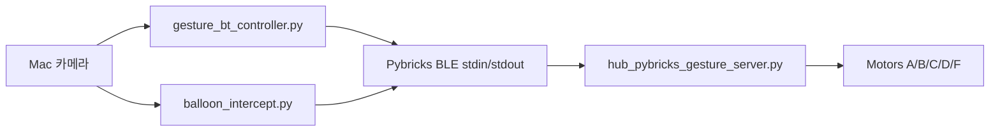

# 아키텍처

## 현재 방향

프로젝트 주력 구조는 **Mac/Python -> Pybricks BLE -> SPIKE Hub** 직결이다.

## 정본 코드

`gesture_bt/`가 기말 프로젝트에서 추적하는 유일한 구현이다. 과거 전송 방식
실험, 복사 패키지, 생성된 모델 파일, 로컬 하네스 설정은 저장소에 포함하지 않는다.

| 구성 요소 | 파일 |
|-----------|------|
| 손 제스처 제어 | `gesture_bt/gesture_bt_controller.py` |
| 풍선/표적 요격 | `gesture_bt/balloon_intercept.py` |
| Hub 펌웨어 | `gesture_bt/hub_pybricks_gesture_server.py` |
| BLE/모터 스모크 테스트 | `gesture_bt/bt_manual_motor_test.py` |
| 공유 BLE 클라이언트 | `gesture_bt/pybricks_ble.py` |

## 공유 저장소 경계

GitHub 저장소는 팀원, 교수, TA가 보는 공유 공간이다. 현재 Pybricks BLE 실행 코드,
기술 문서, README 상태판만 추적한다. 로컬 agent/harness 파일, 가상환경, zip 내보내기,
모델 다운로드, 다른 과목 프로젝트는 Git에서 무시한다.
