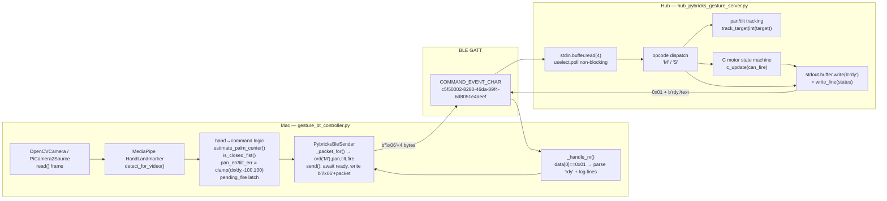

[English version](../ARCHITECTURE.md)

# 아키텍처

제스처로 제어되는 LEGO SPIKE Prime 터릿의 시스템 아키텍처. Mac은 컴퓨터 비전 기반
손 추적을 실행하고 Bluetooth Low Energy(BLE)를 통해 모터 명령을 Pybricks가 플래시된
SPIKE Prime Hub로 스트리밍하며, Hub는 위치 추적 및 발사 state machine을 실행한다.

## 1. 시스템 개요 (Mac ↔ BLE ↔ Hub)

```
┌────────────────────────── Mac (laptop / Raspberry Pi) ──────────────────────────┐
│                                                                                  │
│  Webcam ──► OpenCV frame ──► MediaPipe Hand Landmarker ──► hand→command logic    │
│                                                              │                   │
│                                                  "M,pan_err,tilt_err,fire"       │
│                                                              │                   │
│                                                   PybricksBleSender.send()       │
│                                                              │                   │
│                                          waits for rdy, then writes              │
│                                          b"\x06" + 4-byte packet                 │
└──────────────────────────────────────────────────────────────┼─────────────────┘
                                                                 │  BLE GATT write
                          PYBRICKS_COMMAND_EVENT_CHAR_UUID =      │  (response=True)
                          c5f50002-8280-46da-89f4-6d8051e4aeef    │
                                                                 ▼
┌────────────────────────── SPIKE Prime Hub (Pybricks) ───────────────────────────┐
│                                                                                  │
│  stdin.buffer.read(4) ◄── 0x06 framing stripped by Pybricks ◄── BLE             │
│         │                                                                        │
│         ▼                                                                        │
│  opcode dispatch:  'M' → accumulate pan/tilt target + latch fire                 │
│                    'S' → stop all and exit                                       │
│         │                                                                        │
│         ├─► pan_motor.track_target / tilt_motor.track_target                     │
│         ├─► c_update() fire state machine (armed→firing→returning→armed)         │
│         └─► stdout.buffer.write(b"rdy")  ──► BLE notify (0x01 prefix) ──► Mac     │
└──────────────────────────────────────────────────────────────────────────────-─┘
```

Mac 측은 하드웨어 수준 ACK에서 블로킹하지 않는다. 대신 Hub가 방출하는 애플리케이션
수준 `rdy` 토큰을 기준으로 각 전송을 게이팅한다. 이는 고정된 클럭 없이 두 루프를
결합하며, Hub가 Mac의 속도를 조절한다.

### 물리 포트 (Hub)

| Port | Motor | Role |
|------|-------|------|
| A | `launch_l` | 런처 플라이휠 (PWM `LAUNCH_PWM_A = 100`) |
| B | `launch_r` | 런처 플라이휠, 반대 방향 회전 (PWM `LAUNCH_PWM_B = -100`) |
| C | `c_motor` | 트리거 / 재장전 왕복 모터 (발사 state machine) |
| D | `tilt_motor` | Tilt 축 (`track_target`) |
| F | `pan_motor` | Pan 축 (`track_target`) |

각 포트는 `safe_motor()`로 획득되며, 이는 stdout으로 `PORT_<label>_OK` 또는
`PORT_<label>_MISSING`를 보고하고, 모터가 없어도 허용한다(`None` 반환).

## 2. BLE 연결 → rdy 핸드셰이크 → 패킷 루프 (시퀀스)

```mermaid
sequenceDiagram
    participant Mac as Mac (PybricksBleSender)
    participant BLE as BLE GATT
    participant Hub as Hub (hub_pybricks_gesture_server)

    Mac->>BLE: BleakScanner.find_device_by_name(hub_name)
    BLE-->>Mac: device handle
    Mac->>BLE: client.connect()
    Mac->>BLE: start_notify(COMMAND_EVENT_CHAR, _handle_rx)
    Note over Mac: connected = True

    Note over Hub: User presses Hub center button → main() runs
    Hub->>Hub: stop_all(); reset_angle(0) on pan/tilt/C
    Hub->>Hub: start_launcher_wheels(); display "BT"
    Hub-->>Mac: stdout b"READY" / b"ARMED" (lines, 0x01 prefixed)
    Hub-->>Mac: stdout b"rdy"  (initial handshake)
    Note over Mac: _handle_rx sees "rdy" → self.ready.set()

    loop per send_interval (0.10 s)
        Mac->>Mac: await ready.wait() (timeout=1.0 s)
        Mac->>Mac: ready.clear()
        Mac->>BLE: write_gatt_char(b"\x06" + 4-byte packet, response=True)
        BLE->>Hub: stdin delivers 4 bytes
        Hub->>Hub: read(4); dispatch opcode 'M'/'S'
        Hub->>Hub: track_target(pan/tilt); c_update(can_fire)
        Hub-->>Mac: stdout b"rdy"  (ack: ready for next packet)
        Note over Mac: ready.set() again → next send unblocks
    end

    Mac->>BLE: write_gatt_char(b"\x06" + b"S\x00\x00\x00")
    Hub->>Hub: running = False → stop_all(); display "X"
```

핵심 디테일: Hub는 시작 시 **단 한 번의 초기 `rdy`** 를 보내고(line 162), 그 후
**수신한 모든 패킷마다 한 번의 `rdy`** 를 보낸다(lines 190–193, `if keyboard.poll(0):`
블록 내부). Mac은 `ready.wait()` / `ready.clear()`를 엄격히 교대로 수행하므로 정확히
하나의 패킷만 동시에 전송 중(in flight) 상태가 된다.

## 3. 컴포넌트 다이어그램 (MediaPipe → Sender → BLE → Hub → State Machine)



## 4. 데드락 복구 메커니즘 (heartbeat)

이 흐름 제어 설계 — Mac은 `rdy`를 기다리고, Hub는 패킷을 기다린다 — 는 BLE 링크에서
단일 토큰이 손실될 경우 데드락에 빠질 수 있는 전형적인 상호 대기 구조다.

### 데드락 조건

`bt_manual_motor_test.py`는 이 실패 모드를 명시적으로 문서화한다(lines 102–104):

> Do NOT clear ready here — hub.send() consumes it for the first command.
> Clearing here causes a deadlock: send() waits for rdy, but Hub waits for a packet.

`rdy` 알림이 누락되면 Mac의 `await asyncio.wait_for(self.ready.wait(), ...)`가 절대
해소되지 않고, Hub는 `keyboard.poll(0)` 분기에서 결코 오지 않을 다음 4바이트를
기다리며 유휴 상태로 머문다.

### Mac 측 복구 (`send()`, lines 162–173)

`await ready.wait()`는 `timeout=timeout`(기본값 `1.0` s)으로 제한된다.
`asyncio.TimeoutError` 발생 시 전송은 **블로킹 재시도가 아니라 포기**된다: `send()`는
단순히 반환한다. 카메라 루프가 매 `send_interval`(0.10 s)마다 `send()`를 다시
호출하므로, 다음 패킷 시도가 `rdy`를 다시 대기한다. 이후 임의의 `rdy`가 도착하는
즉시(Hub는 처리된 패킷당 하나씩 계속 방출함) 루프가 재동기화된다. 진단 메시지는 최대
2.0 s마다 한 번씩만(`now - self.last_wait_log > 2.0`) 출력되어 사용자에게 Hub를 점검할
것을 알린다.

### Hub 측 복구 (안전 타임아웃, lines 213–216)

Hub는 안전을 유지하기 위해 연속적인 트래픽에 의존하지 않는다. 매 루프 반복마다 다음을
검사한다:

```python
if watch.time() - last_cmd_ms > COMMAND_TIMEOUT_MS:   # 1000 ms
    pan_target  = 0.0
    tilt_target = 0.0
```

`COMMAND_TIMEOUT_MS = 1000` ms 동안 `'M'` 패킷이 도착하지 않으면 pan/tilt 타겟이
중앙(0.0)으로 붕괴되므로, 멈추거나 손실된 링크는 터릿을 마지막 명령 각도에 고정시키는
대신 중앙에 정렬(park)시킨다. C-motor state machine은 매 반복마다 독립적으로 계속
진행되므로, 진행 중인 발사/재장전은 링크 상태와 무관하게 완료된다.

### 종합 효과

`rdy` 토큰은 패킷 단위 heartbeat 역할을 한다. 하나의 비트(beat)가 손실되면 Hub에서
최대 한 번의 `COMMAND_TIMEOUT_MS` 윈도우(터릿 재중앙 정렬)와 Mac에서 한 번의
`timeout` 윈도우(한 번의 전송 누락)의 비용이 발생하며, 그 후 다음 `rdy`/패킷 쌍이
lockstep을 재확립한다. 양측 모두 무한 상호 대기 대신 독립적인 타임아웃을 가지므로
영구적인 데드락 상태는 존재하지 않는다.
