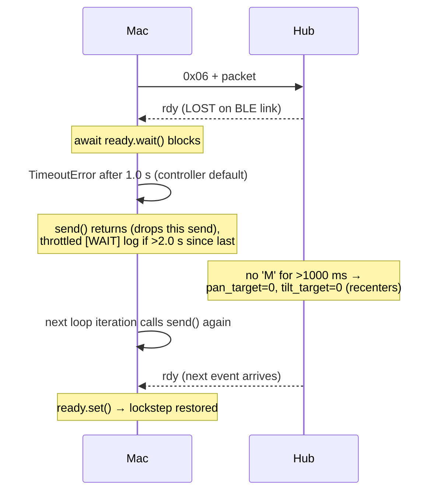

[English version](../PROTOCOL.md)

# 프로토콜

Mac 컨트롤러(`gesture_bt_controller.py`, `bt_manual_motor_test.py`)와 Pybricks Hub
프로그램(`hub_pybricks_gesture_server.py`) 사이의 와이어 프로토콜. 전송 계층은 Pybricks
command/event characteristic 상의 BLE GATT다:

```
PYBRICKS_COMMAND_EVENT_CHAR_UUID = "c5f50002-8280-46da-89f4-6d8051e4aeef"
```

## 1. 프레이밍

| Direction | Framing | Notes |
|-----------|---------|-------|
| Mac → Hub | `b"\x06"` prefix + 4 payload bytes | `0x06`은 Pybricks의 "write to stdin" 명령이다. Pybricks가 이를 제거하고 4개의 payload 바이트를 프로그램의 `stdin`으로 전달한다. |
| Hub → Mac | `0x01` prefix + payload | `0x01`은 Pybricks의 "stdout event"다. Mac은 파싱 전에 `data[0] == 0x01`을 확인한다. |

Mac은 항상 `response=True`로 write한다:

```python
await self.client.write_gatt_char(
    PYBRICKS_COMMAND_EVENT_CHAR_UUID,
    b"\x06" + packet,
    response=True,
)
```

## 2. Mac → Hub 패킷 포맷 (0x06 이후 4바이트)

`PybricksBleSender._packet_for()` / `bt_manual_motor_test.packet_for()`로 생성되고
Hub가 `stdin.buffer.read(4)`를 통해 소비한다.

| Byte | Field | Type | Encoding | Hub-side decode |
|------|-------|------|----------|-----------------|
| 0 | `opcode` | `uint8` | `ord("M")` = 0x4D (move) 또는 `ord("S")` = 0x53 (stop) | `opcode = data[0]` |
| 1 | `pan_err` | `int8` | `[-100, 100]`로 clamp 후 `value & 0xFF` (2의 보수) | `pan_err = i8(data[1])` |
| 2 | `tilt_err` | `int8` | `[-100, 100]`로 clamp 후 `value & 0xFF` | `tilt_err = i8(data[2])` |
| 3 | `fire` | `uint8` | `0` 또는 `1` (`int(parts[3]) & 0xFF`) | `fire = data[3]` |

### int8 왕복(round-trip)

Mac 인코딩 (`_i8`, controller lines 143–146):

```python
value = max(-100, min(100, int(value)))
return value & 0xFF        # negative → 256+value, e.g. -100 → 156 (0x9C)
```

Hub 디코딩 (`i8`, server lines 82–83):

```python
return byte_value - 256 if byte_value > 127 else byte_value
```

따라서 `pan_err`/`tilt_err`는 Hub에서 정확히 복원되며, 범위는 `[-100, 100]`이다.

### Stop 패킷

`STOP`은 리터럴 `b"S\x00\x00\x00"`(opcode `'S'`, 0 바이트 3개)에 매핑된다. Hub는
`running = False`로 설정하고 루프를 빠져나간 뒤 `stop_all()`을 실행하고 `"X"`를
표시한다. 참고: `bt_manual_motor_test.HubClient.close()`는 문자열 `"CENTER"`를 보내는데,
이는 `packet_for()`가 알지 못하는 값이라 `ValueError`를 발생시킨다. 이 호출은
`try/except`로 감싸져 있으므로 close는 여전히 `client.disconnect()`까지 진행된다.

### Hub 측 의미론 (opcode 'M')

`pan_err`/`tilt_err`는 절대 각도가 아니라 **증분 오차 입력(incremental error input)**
이다. 이들은 타겟 각도로 누적된다(`STATE_MACHINES.md` 참조):

```python
pan_target  = clamp(pan_target  - PAN_SIGN  * pan_err  * GAIN, PAN_MIN,  PAN_MAX)
tilt_target = clamp(tilt_target - TILT_SIGN * tilt_err * GAIN, TILT_MIN, TILT_MAX)
if fire == 1:
    can_fire = True   # latch until shot fires
last_cmd_ms = watch.time()
```

## 3. Hub → Mac 메시지

Hub 출력은 라인 단위 텍스트와 단순 `rdy` 토큰으로 구성되며, 모두 `stdout.buffer`로
방출되어 `0x01` prefix가 붙은 알림(notification)으로 Mac에 전달된다.

| Message | Meaning |
|---------|---------|
| `b"rdy"` | 흐름 제어 토큰: Hub가 다음 패킷을 받을 준비가 됐음. 개행으로 종료되지 않음. |
| `PORT_<label>_OK` / `PORT_<label>_MISSING` | 포트별 모터 초기화 결과. |
| `READY`, `ARMED`, `FIRING`, `RETURNING`, `FIRED` | 상태 라인 (`write_line`을 통해 개행으로 종료됨). |

Mac 측 처리 (`_handle_rx`, controller lines 124–141): `b"rdy" in payload`이면
`self.ready.set()`을 호출하고 payload에서 `rdy`를 제거한다. 나머지 텍스트는 버퍼링되어
`\n`으로 분할된 뒤 `[Hub] <line>` 로그로 출력된다.

### Heartbeat 정책

`rdy`가 heartbeat다. 이를 방출하는 **고정 타이머는 없으며**, 이벤트 기반이다:

1. **시작 시**: `READY`/`ARMED` 이후 정확히 한 번의 `rdy`(server line 162). 이로써
   Mac이 전송을 시작할 수 있다.
2. **패킷당**: 수신한 모든 4바이트 패킷 이후 정확히 한 번의 `rdy`(server lines
   190–193). 패킷을 읽은 동일한 `if keyboard.poll(0):` 블록 내부에 있다.

Mac은 각 wait이 성공한 직후 `ready`를 즉시 clear(`self.ready.clear()`)하여
one-packet-in-flight를 강제하므로, cadence는 사실상 `send_interval`(0.10 s)당 하나의
`rdy` — 즉 Hub가 속도를 조절하는 약 10 Hz 애플리케이션 heartbeat가 된다.

## 4. rdy 핸드셰이크 흐름

### 정상 흐름

```mermaid
sequenceDiagram
    participant Mac
    participant Hub
    Hub-->>Mac: rdy (initial, after READY/ARMED)
    Note over Mac: ready.set()
    Mac->>Mac: await ready.wait() → ok; ready.clear()
    Mac->>Hub: 0x06 + [M,pan,tilt,fire]
    Hub->>Hub: read(4), apply command
    Hub-->>Mac: rdy
    Note over Mac: ready.set()
    Mac->>Mac: next send: await ready.wait() → ok; ready.clear()
    Mac->>Hub: 0x06 + next packet
```

### 손실 / 복구 흐름



## 5. 타임아웃 정책

| Timeout | Value | Location | Effect |
|---------|-------|----------|--------|
| Command timeout (Hub) | `COMMAND_TIMEOUT_MS = 1000` ms | server lines 54, 213–216 | 1000 ms 동안 `'M'` 패킷 없음 → pan/tilt 타겟이 0.0으로 리셋(재중앙 정렬). |
| `send()` rdy wait (controller) | `timeout = 1.0` s default | controller line 162, 166 | `ready.wait()`이 제한됨. 타임아웃 시 전송은 건너뜀(블로킹 재시도 안 함). |
| Close-time STOP (controller) | `timeout = 0.2` s | controller lines 187, 468 | 종료 시 best-effort STOP. |
| `send()` rdy wait (manual test) | `timeout = 5.0` s default, `10.0` s per command | test lines 70, 129 | 더 느린 수동 테스트 시퀀스를 위한 긴 대기. |
| Scan timeout | `15.0` s | both `connect()` | BLE 장치 탐색 윈도우. |
| BLE write ACK | `response=True` | all writes | GATT 수준 write-with-response. `rdy` 애플리케이션 ACK와는 직교(독립)적. |

두 계층은 독립적이다: GATT `response=True`는 바이트가 characteristic에 도달했음을
확인하고, `rdy`는 Hub 프로그램이 패킷을 처리했고 다음 패킷을 받을 준비가 됐음을
확인한다. 데드락 복구는 GATT 계층이 아니라 애플리케이션 계층 타임아웃(Hub 1000 ms,
Mac 1.0 s)에 의존한다.
