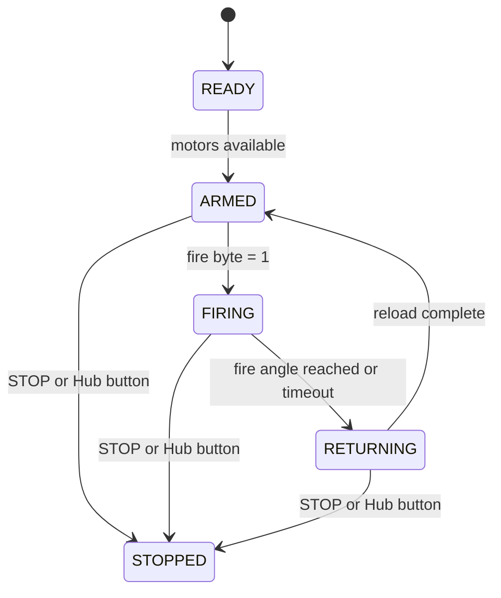
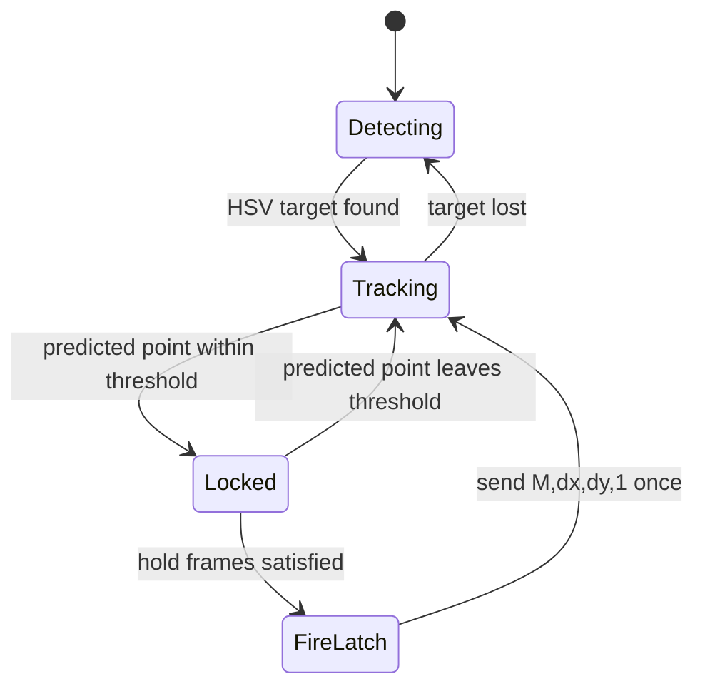

# 상태 머신

## Hub 발사 흐름

Hub는 발사 상태와 팬/틸트 추적을 분리한다. 따라서 armed 상태에서 조준을 계속
갱신하다가 `fire=1`이 들어오면 발사 상태로 진입한다.

Hub는 발사 중 각도 스냅샷을 출력한다.

| 로그 | 시점 |
|------|------|
| `SHOT_START` | `fire=1`을 받아 C 모터가 움직이기 시작한 순간 |
| `SHOT_RELEASE` | C 모터가 `C_FIRE_ANGLE - C_TOLERANCE`에 도달한 순간 |
| `SHOT_DONE` | C 모터가 장전 위치로 돌아온 순간 |

각 스냅샷에는 실제 `pan_F`, `tilt_D`, `c_C` 모터 각도와 `target_pan`,
`target_tilt` 목표 각도가 포함된다.

## Mac 표적 요격 흐름

`balloon_intercept.py`는 발사 패킷 한 번에만 `fire=1`을 넣고, 이후 패킷은 다시
`fire=0`으로 돌아간다.

## 손 제스처 흐름

손바닥이 보이면 화면 중심 대비 오차로 팬/틸트를 제어한다. 주먹 전환은
`fire=1`을 한 번 래치한 뒤 다음 전송에서 해제한다.
