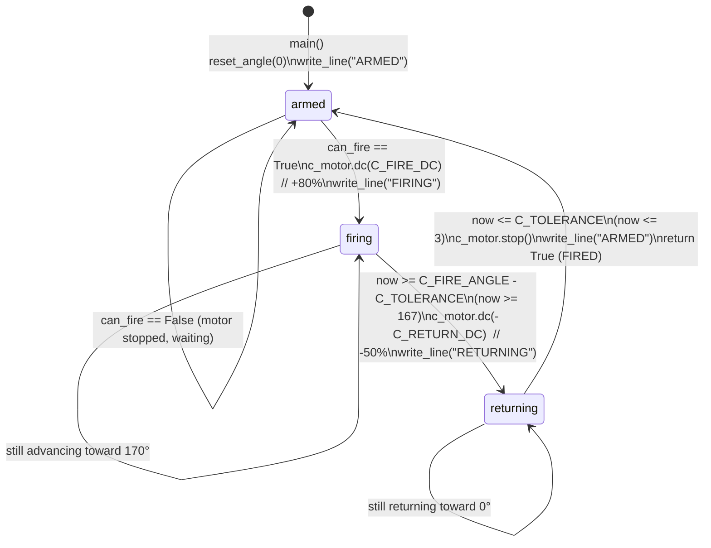

[English version](../STATE_MACHINES.md)

# STATE MACHINES

Hub(`hub_pybricks_gesture_server.py`)에서 실행되는 제어 로직과, Hub 및
Mac(`gesture_bt_controller.py`)에 걸쳐 분산된 발사 latching 로직.

## 1. C Motor 발사 State Machine (왕복 / reciprocating)

포트 C는 트리거/재장전 메커니즘을 구동한다. 시작 위치 `0°` = 완전 장전 상태(고무줄이
장전됨). 상태는 모듈 수준 `c_state`에 보관되며 `c_update(can_fire)`에 의해 메인 루프
반복마다 한 번씩 진행된다.

### Constants (server lines 60–63)

| Constant | Value | Meaning |
|----------|-------|---------|
| `C_FIRE_ANGLE` | `170` deg | 전진 발사 위치(고무줄 발사). |
| `C_FIRE_DC` | `80` % | 전진(발사) duty cycle. |
| `C_RETURN_DC` | `50` % | 역방향(재장전) duty cycle, `-C_RETURN_DC`로 적용. |
| `C_TOLERANCE` | `3` deg | 발사/홈 위치 도달을 위한 각도 여유(slack). |

### State diagram



### 전이 로직 (server `c_update`, lines 110–136)

```python
now = c_motor.angle()
if c_state == "armed":
    if can_fire:
        c_motor.dc(C_FIRE_DC); c_state = "firing"; write_line("FIRING")
elif c_state == "firing":
    if now >= C_FIRE_ANGLE - C_TOLERANCE:          # now >= 167
        c_motor.dc(-C_RETURN_DC); c_state = "returning"; write_line("RETURNING")
elif c_state == "returning":
    if now <= C_TOLERANCE:                          # now <= 3
        c_motor.stop(); c_state = "armed"; write_line("ARMED")
        return True                                 # fire + reload complete
return False
```

`c_update`가 `True`를 반환하면 메인 루프는 `FIRED`를 방출하고 latch를
해제(`can_fire = False`, server lines 207–209)하므로, 다음 발사는 Mac으로부터 새로운
`fire=1`을 필요로 한다.

이 state machine은 **non-blocking**이다: 각 호출은 각도를 한 번 읽고 최대 한 번의
전이만 수행한다. 전진(`dc`)과 역방향 움직임은 반복 사이에 open-loop로 실행되며, 메인
루프가 pan/tilt 추적과 BLE I/O를 계속 처리하는 동안 진행된다.

## 2. 발사 Latch 메커니즘 — `pending_fire`가 존재하는 이유

발사 요청은 서로 다른 속도로 실행되는 두 개의 독립적인 루프를 가로지르며, 주먹은
순간적인 edge 이벤트인 반면 전송은 주기적인 샘플이다. 단 하나의 주먹이 정확히 한 발의
발사를 만들도록 두 개의 latch가 협력한다.

### Latch A — Mac edge-to-interval latch (`pending_fire`)

탐지는 매 카메라 프레임마다 실행되지만, 명령은 `send_interval`(0.10 s)마다만 전송된다.
주먹 전이는 두 전송 사이에 발생할 수 있으므로, edge는 다음 전송 윈도우까지 유지되어야
한다.

Edge 탐지 (controller lines 433–436):

```python
# latch fire on open→fist transition; consumed at send time
if fist and not prev_fist:
    pending_fire = True
prev_fist = fist
```

전송 시점의 소비 (controller lines 444–448):

```python
if now - last_send_time >= args.send_interval:
    if result.hand_landmarks:
        fire_to_send = 1 if pending_fire else 0
        pending_fire = False
        command = f"M,{pan_err},{tilt_err},{fire_to_send}"
```

**필요한 이유(Mac 측 타이밍 문제):** `pending_fire`가 없으면, 코드는 전송 시점에 실시간
`fist` 불리언을 읽어야 한다. 두 전송 시점 사이에 주먹이 쥐어졌다가 풀리면 이벤트가
손실되고, 여러 전송에 걸쳐 주먹이 유지되면 `fire=1`을 반복 방출하여 여러 번 발사하게
된다. `pending_fire`는 비동기적 open→fist *edge*를 주기적 *전송 샘플*과 분리한다 —
edge가 언제 발생하든 이를 포착하고, 다음 전송에서 정확히 하나의 `fire=1`이 전달됨을
보장한 뒤 리셋한다. `prev_fist`는 (유지된 주먹이 아니라) open→fist 전이만 이를
설정하도록 보장한다.

### Latch B — Hub shot latch (`can_fire`)

Hub에서 `fire == 1`은 `can_fire = True`로 설정하고, 이는 "until shot fires"(발사될
때까지) 유지된다(server lines 184–185). C state machine은 `armed` 상태에서만 이를
소비하므로, 사이클 중간에 도착한 발사 요청은 메커니즘이 armed로 돌아오면 한 번 처리되고,
완료 시 `can_fire`가 해제된다(`can_fire = False`, server line 209). 이는 모터가 이미
발사 중이거나 복귀 중일 때 요청이 떨어져 드롭되는 것을 방지하고, 이후의 자동 반복을
방지한다.

### 결합된 보장(Combined guarantee)

```
open→fist edge (any frame)  →  pending_fire=True
   → next send (0.10 s grid) →  fire=1 sent once, pending_fire=False
      → Hub: can_fire=True (latched)
         → C machine reaches armed → fires once → FIRED → can_fire=False
```

하나의 주먹 ⇒ 한 발의 발사. Mac 측의 전송 간 타이밍과 Hub 측의 사이클 중간 도착 모두에
대해 견고하다.

## 3. Pan / Tilt 추적 — GAIN 누적

Pan과 tilt는 **적분(누적) 제어기**다. Mac은 매 tick마다 오차 신호를 전송하고, Hub는
이를 절대 타겟 각도로 적분한 뒤 Pybricks의 `track_target`이 위치 루프를 닫게 한다.

### Constants (server lines 45–53)

| Constant | Value | Meaning |
|----------|-------|---------|
| `PAN_SIGN` / `TILT_SIGN` | `1` / `1` | 방향 반전(축이 반대로 움직이면 `-1`로 설정). |
| `PAN_MIN` / `PAN_MAX` | `-35` / `35` deg | Pan 타겟 clamp 범위. |
| `TILT_MIN` / `TILT_MAX` | `0` / `80` deg | Tilt 타겟 clamp 범위. |
| `PAN_SPEED` / `TILT_SPEED` | `600` / `500` deg/s | 속도 feedforward(튜닝용 상수). |
| `GAIN` | `0.05` | 오차 1 단위당 타겟 변화 각도(degree). |

### 누적(Accumulation) (server lines 182–183)

```python
pan_target  = clamp(pan_target  - PAN_SIGN  * pan_err  * GAIN, PAN_MIN,  PAN_MAX)
tilt_target = clamp(tilt_target - TILT_SIGN * tilt_err * GAIN, TILT_MIN, TILT_MAX)
```

수신된 각 오차는 실행 중인 타겟을 `error * GAIN` 도만큼 밀어내고, 그 결과는 축 한계로
clamp된다. `GAIN = 0.05`일 때 최대 오차 `100`은 패킷당 타겟을 `100 * 0.05 = 5` 도
이동시킨다. 약 10 Hz 전송 속도에서 이는 약 50 deg/s의 타겟 slew이므로, 터릿은 손이 있는
방향으로 갑자기 튀지 않고 부드럽게 pan/tilt한다. `pan_err`/`tilt_err`의 부호(프레임
중심으로부터의 손바닥 오프셋, Mac에서 `[-100, 100]`로 clamp됨)가 방향을 결정하고,
뺄셈과 `PAN_SIGN`/`TILT_SIGN`이 규약(convention)을 설정한다.

### 타겟 적용 (server lines 195–200)

```python
if pan_motor:
    pan_motor.track_target(int(pan_target))
if tilt_motor:
    tilt_motor.track_target(int(tilt_target))
```

`track_target`은 매 루프 반복(5 ms `wait`)마다 연속적으로 실행되어 모터를 최신 적분
타겟으로 구동한다. 오차가 0(손이 없거나, 손바닥이 Mac deadzone 내 중앙에 위치)이면
타겟이 변하지 않아 위치를 유지한다.

## 4. 안전 타임아웃 동작

명령 트래픽 손실이 터릿을 마지막 타겟에 조준·통전된 상태로 두어서는 안 된다. 매 반복마다
Hub는 마지막 `'M'` 패킷 이후 경과 시간을 검사한다(server lines 213–216):

```python
if watch.time() - last_cmd_ms > COMMAND_TIMEOUT_MS:   # 1000 ms
    pan_target  = 0.0
    tilt_target = 0.0
```

`last_cmd_ms`는 모든 `'M'` 패킷마다 갱신된다(`last_cmd_ms = watch.time()`). 명령 없이
1000 ms가 경과하면(링크 정지, `rdy` 손실, Mac 크래시) pan과 tilt 타겟이 `0.0`으로
붕괴되므로, `track_target`이 터릿을 중앙으로 되돌린다. C-motor state machine은 이
타임아웃에 의해 **의도적으로 리셋되지 않는다**: 진행 중인 발사/재장전이 스트로크 도중
멈추지 않고 안전하게 완료된다.

추가 정지 경로:

- **비상 정지 버튼**: `if hub.buttons.pressed(): running = False`(server lines
  219–220)가 루프를 빠져나가 → `stop_all()` + `"X"` 표시.
- **Stop opcode**: `'S'` 패킷이 `running = False`로 설정한다(lines 187–188).
- **예외 가드(Exception guard)**: 전체 `main()`이 감싸져 있어 어떤 `BaseException`이든
  `stop_all()`을 실행하고 `"X"`를 표시한다(lines 228–232).
- **시작 디바운스(Startup debounce)**: `while hub.buttons.pressed(): wait(20)`(lines
  157–158)이 초기 `rdy`를 보내기 전에 버튼 해제를 기다리므로, 시작 누름이 비상 정지로
  오인되지 않는다.
